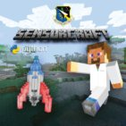

README
******

    
    
.. image:: https://readthedocs.org/projects/sensorcraft/badge/?version=latest
	:target: http://sensorcraft.readthedocs.io/en/latest/?badge=latest
	:alt: Latest Documentation Status
	
.. image:: https://readthedocs.org/projects/sensorcraft/badge/?version=stable
	:target: http://sensorcraft.readthedocs.io/en/stable/?badge=stable
	:alt: Stable Documentation Status

`Introduction YouTube video <https://youtu.be/nZWZNGVQwbM>`_ is now available!
Most people are familiar with Minecraft (Minecraft is developed  by Mojang and
not related to this programming tutorial nor do    they endorse this tutorial)
for this project we are using a      Minecraft type environment created in the
Python programming     language. The Air Force Research Laboratory (AFRL)
Sensors       Directorate located in Dayton, Ohio created this guide to
inspire kids of all ages to learn to program and at the same     time get an
idea of what it is like to be a Scientist or         Engineer for the Air Force.
To get started download the         `latest release zip file
<https://github.com/rovitotv/SensorCraft/releases/latest>`_  and unzip, then
open the file "index.html" file in your browser.

A `YouTube video has been created <https://youtu.be/C9n1bS54AIw>`_
to show students how to install SensorCraft and Enthought Canopy
then run the examples.  The video is for Mac OS X but the process
for Windows and Linux is similar.  

  
GitHub Release
==============

`v1.7.1 Changed gravity and jump height back to default <https://github.com/rovitotv/SensorCraft/releases/download/v1.7.1/SensorCraftV1.7.1.zip>`_

`v1.7 Crushed bugs and added a new chapter on creating the NMUSAF <https://github.com/rovitotv/SensorCraft/releases/download/v1.7/SensorCraftV1.7.zip>`_

`v1.6 Much improved install and run directions <https://github.com/rovitotv/SensorCraft/releases/download/v1.6/SensorCraftV1.6.zip>`_

`v1.5  Directory consolidation <https://github.com/rovitotv/SensorCraft/releases/download/v1.5/SensorCraftV1.5.zip>`_

`v1.4 Rocket Launch <https://github.com/rovitotv/SensorCraft/releases/download/v1.4/SensorCraftV1.4.zip>`_

`v1.3 Mores Updates to README <https://github.com/rovitotv/SensorCraft/releases/download/v1.3/SensorCraftV1.3.zip>`_

`v1.2 Update to README <https://github.com/rovitotv/SensorCraft/releases/download/v1.2/SensorCraftV1.2.zip>`_

`v1.1 First CD release <https://github.com/rovitotv/SensorCraft/releases/download/v1.1/SensorCraftV1.1.zip>`_

The latest version will always be on the `github project site 
<https://github.com/rovitotv/SensorCraft>`_.

CD Release
==========

For STEM events we have created a CD from this content, to begin with the CD open index.html

Last commit before March 3rd, 2016 demonstration for My Brother's Keeper STEM 
Event

Overview of the products in this directory for the CD release:

* HTML web version that can be open in web browser is in _build/html/index.html
* PDFs of the web pages are in PDFs/
* code includes python code for the different exercises
* images the images that appear in the PDFs and HTML
* OriginalFoglemanCode the code started 
* SensorCraftLogo is a directory with the CD cover and RYA generated art work
* EnthoughtCanopy directory contains Windows and Mac versions of Enthought Canopy Express, please check the Enthought web site for the latest version

The CD doesn't have the rocket launch chapter so consider updating from the
latest github release.

Logos and Third Party Materials
===============================

Python
------

Python is an open source programming language and it's logo is meant to be
used on Python derived products see https://www.python.org/community/logos/

We believe this product conforms to the Python Software Foundation's 
policy. 

Minecraft by Mojang
-------------------

Mojang the creators of Minecraft are liberal with their IP:
https://account.mojang.com/documents/brand_guidelines

We believe this product conforms to Mojang's guidelines.

Enthought Canopy Express
------------------------

Included on the CD is Enthought Canopy Express which is a Python distribution
that includes Python plus pyglet that performs the OpenGL work.  In addition
Enthought Canopy Express includes an excellent editor that will make it easier
to work with the code.  Enthought offers an academic product that is free for
students and teachers, more `details are provided at Enthought's web site
<https://store.enthought.com/#canopy-academic>`_

Question 10 of `Enthought's Canopy FAQ
<https://www.enthought.com/products/canopy/faq/>`_ grants us permission to
redistribute Enthought Canopy Express and can include it on CDs or DVDs.

Miscellaneous
=============

This project is done with restructured text which is Python's default for
documentation it creates html pages.  

References to Sphinx documentation:
https://pythonhosted.org/an_example_pypi_project/sphinx.html

Steps to build and make release
-------------------------------

Assume the version we are going to release is 1.5 and will reside in
~/temp/SensorCraftV1.5. The makefile within the project will build the html
files with this command::

	cd /Volumes/SecureCode/SensorCraft/guide
	make clean && make html
	mkdir ~/temp/SensorCraftV1.5
	cd _build/html
	cp -av * ~/temp/SensorCraftV1.5
	cp ~/temp/SensorCraftV1.5/index.html ~/temp/SensorCraftV1.5/START_HERE.html
	cd ../../..
	cp -av code ~/temp/SensorCraftV1.5/
	cd ~/temp
	zip -r SensorCraftV1.5.zip SensorCraftV1.5
	cd /Volumes/SecureCode/SensorCraft

Makes changes to the README.rst to reflect a new release, then perform the
following commands::

	git commit -a
	git tag -a v1.5 -m "version 1.5 - Directory consolidation"
	git push
	git push --tags

Dependencies
------------

pyglet for OpenGL support and sphinx to build the documentation

 
