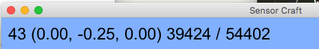
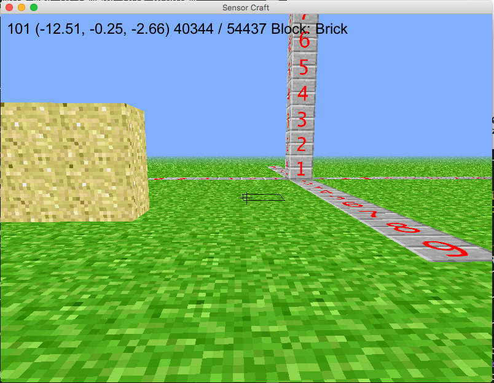

03 Show Current Block
---------------------

One thing about SensorCraft that is annoying is the GUI does not show the
current block selected.  Sometimes you forget which block is selected and will
place the wrong block accidentally.  A simple way to remedy this problem
is extend the "draw_label" method which we talked about in the previous chapter
that shows the numbers in the upper left corner:

To get started with this programming exercise first copy
02_3D_coordinate_system_TVR.py code to a new file
03_show_current_block_TVR.py but replace TVR with your initials using the
following command::

	cp 02_3D_coordinate_system_TVR.py 03_show_current_block_TVR.py.py	

This command will start a new file with all the traits of the last exercise
being the world is flat, press the B key a wall will be constructed, and the
three number lines exist on each axis. How do you think the "draw_label" method
should be extended to also display the block that is currently selected?  If you
examine the __init__ method for the class called Window on line 435 - 494 you
will notice many variables are being initiated.  These variables have comments
above them that describe the purpose of the variables which is convenient for us
because we didn't write the original code.  Take special note of the variable
'self.block' on line 477 which contains the current block the user can place.
Using an if/elif construct like we did in the programming exercise on building
automatically we can examine the variable 'self.block' then build the proper
text.  Jump down to line 836 where the draw_label method lives and we changed
the code to look like the following:

.. literalinclude:: ../code/03_show_current_block.py
	:lines: 836-854

After that change is made and you run the new game with the command::

	python 03_show_current_block.py

Now you can see the block selected in the label like the following example:

Another GUI element that is easy to change is the target cursor.  I actually
like the target cursor in SensorCraft but I want to take this time to show you
how easy it is to change its color and size so you can customize as you see fit.
The SensorCraft code refers to the target cursor as a "reticle" which is the
same thing but is less characters to type.  First to change the color look at
the "draw_recticle" method starting on line 856:

 .. literalinclude:: ../code/03_show_current_block.py
	:lines: 856-861

The OpenGL function "glColor3d" which is imported by pyglet.gl uses the RGB
(red, green, blue) color model.  The RGB color model is simply the amount of
color to apply when it is 0 no color is applied but when it is 255 as much of
that color as possible is used.  It turns out you can represent a large number
of colors with some mixture of red, green, and blue.  If you want the reticle to
be  red change line 860 to be "glColor3d(255, 0, 0)". How about if you want a
totally green reticle?  Then change line 860 to be "glColor3d(0, 255, 0)".  By
default SensorCraft uses a black reticle by removing all color by setting the
RGB values all to 0, with the line 860 "glColor3d(0, 0, 0)". If you want a white
reticle use this for line 860 "glColor3d(255, 255, 255)".  To change the size of
the reticle simply change line 772 from "n = 10" to "n = 20" that will double
the reticles size, experiment with different size n to see which size you like
best.
