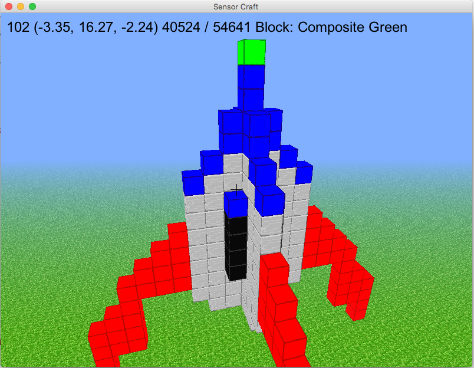

================
07 Rocket Launch 
================

Using the Keyboard to Launch a Rocket - Part 1
----------------------------------------------

Now that you can save and load models that are made out of the new high tech
composite blocks lets put those skills to use to load then launch a rocket.
Rockets are amazing machines that the USAF uses to lift satellites to orbit. 

For this exercise we used the previous exercise  06_reading_the_pickeld_world to
create a rocket similar to the rocket on the cover art for SensorCraft.  Use
only the composite blocks and the previous exercise 06_reading_the_pickled_world
to build a rocket of your own design or you can use the supplied pickle file
called "rocket.pkl" in the code directory.  To get started with this programming
exercise first copy the file 06_reading_the_pickled_world.py python code to a
new file 07_rocket_launch_TVR.py but replace TVR with your initials using the
following command::

    cp 06_reading_the_pickled_world.py 07_rocket_launch_TVR.py

First we need to create a new variable within the "Model" class that helps the
class keep track of whether the rocket has been loaded or not.  This will
prevent a player from loading the a rocket multiple times.  Jump down to line
157 and add the code shown below:

.. literalinclude:: ../code/07_rocket_launch.py
	:lines: 157-159

Next jump down to line 445 and create a new method called "move_rocket_up" 
which will move the rocket up one block.  The new "move_rocket_up" method is
shown below:

.. literalinclude:: ../code/07_rocket_launch.py
	:lines: 445-471

Our rocket will include the advanced ability to land so at line 473 add a 
new method called "move_rocket_down" which will move the rocket down one
block.  The new "move_rocket_down" method is shown below:

.. literalinclude:: ../code/07_rocket_launch.py
	:lines: 473-499

Next we need to make sure the position and rotation of Dr. Steve is correct
so when the rocket appears we will be looking at the rocket and not somewhere
else.  Feel free to adjust these numbers as you see fit, the rotation and
position variable that we use in this guide are just suggestions.  A little
experimentation goes along way when setting position and rotation variables.
On line 521 - 531 of the Window constructor in the method called __init__
change the self.position and self.rotation variables as shown below:

.. literalinclude:: ../code/07_rocket_launch.py
	:lines: 521-531

The last thing we need to do is modify the familiar method "on_key_press" so
when the "L" key is pressed the "move_rocket_up" method is called and when
the "K" key is pressed the "move_rocket_down" method is called.  The new
"on_key_press" method is listed below:

.. literalinclude:: ../code/07_rocket_launch.py
	:lines: 777-814

Notice that the new methods "move_rocket_up" and "move_rocket_down" are both
in the class called "Model".  This is expected because manipulating blocks is
done by changing the world data dictionary and it is located within the 
model class.  It is fun to use the "K" key to make the rocket go beneath the
ground.  

Using Time to Launch a Rocket - Part 2
--------------------------------------

Part 1 used the "L" key and the "K" key to make the rocket go up and down,
while this is a good start it is not very realistic.  In part 2 we are going
to make the rocket go up and down based on the SensorCraft update loop.  In
programming a common approach is to take a complicated problem and break it
down into much smaller pieces, then solve each of those pieces individually.
A common phrase is "How do you eat an elephant? One bite at a time".  

First the model class needs several new variables added to the code so move
down to line 161 and enter the code below:

.. literalinclude:: ../code/07_rocket_launch_part2.py
	:lines: 161-173

One of the new variables we added was rocket altitude this is simply number
of blocks with 0 altitude representing the starting point.  Recall for our
coordinate system in SensorCraft Y represents height above the ground plane.
Next on line 466 you want to add a line that will increase the altitude one
block every time the method "move_rocket_up" is called:

.. literalinclude:: ../code/07_rocket_launch_part2.py
	:lines: 459-486

We should make the same change for the corresponding function 
"move_rocket_down" which will decrease the altitude by one block every time
the method is called:

.. literalinclude:: ../code/07_rocket_launch_part2.py
	:lines: 488-515

Next we need to add two methods at the end of the model class:

.. literalinclude:: ../code/07_rocket_launch_part2.py
	:lines: 517-543

The method "launch_rocket" is simple it checks to make sure the rocket
is loaded, meaning the user pressed the "O" key, and the rocket is not
launched.  If both of those conditions are met then rocket_launched is set
to true and the rocket_mode is set to "up".  The method "process_rocket" is
more complicated but still easy to understand.  The first thing it does is
check for three conditions rocket_loaded, rocket_launced, and 
rocket_update_count >= 8.  The rocket_update_count is used to slow down the
updates of the rocket because the update method in the Window class is called
more frequently than we need to update the rocket.  If all three of the previous
conditions are met then the method will call the "move_rocket_up" or
"move_rocket_down" method based on the rocket_mode.  At the end of the 
"process_rocket" method it checks to see if the modes need to be changed
depending on rocket_altitude.  

Next we have to update the familiar method "on_key_press" to use the
new methods we just created in the model class:

.. literalinclude:: ../code/07_rocket_launch_part2.py
	:lines: 822-857

Finally we have to modify the update method in the window class.  Since
different speed computers exist one common technique used in simulations is to
base events on time.  SensorCraft is set to call the update method in the
window class 1.0 / TICKS_PER_SEC or 1/60th of a second on line 608. All we
have to do is call the process_rocket method in the model class using the
code below on line 672:

.. literalinclude:: ../code/07_rocket_launch_part2.py
	:lines: 672 - 694

Dr. Steve Rides the Rocket - Part 3
-----------------------------------

In part 1 and part 2 of the rocket launch, Dr. Steve was on the ground while the
rocket was launched. In part 3, we are going to put Dr. Steve on top of the
rocket so that he rides it. First, we are going to add to the rocket process on
line 695 so that Dr. Steve goes up as the rocket goes up. Add the line "if
self.model.rocket_launched:" and then add
"self.position = (10, self.model.rocket_altitude + 19, 2)" below that. The new
position is where Dr. Steve will go when the rocket is launched, which is on top
of the rocket. What you have now should look like this:

.. literalinclude:: ../code/07_rocket_launch_part3.py
        :lines: 696 - 702

Finally, we need to add "if self.model.rocket_loaded:" on line 856, and then add
"self.position = (10, 20, 2)" below that. This makes it so that when you press
"L" to launch the rocket, Dr. Steve is put on top of the rocket so that he can
ride it. The code should look similar to this:

.. literalinclude:: ../code/07_rocket_launch_part3.py
        :lines: 862 - 865

