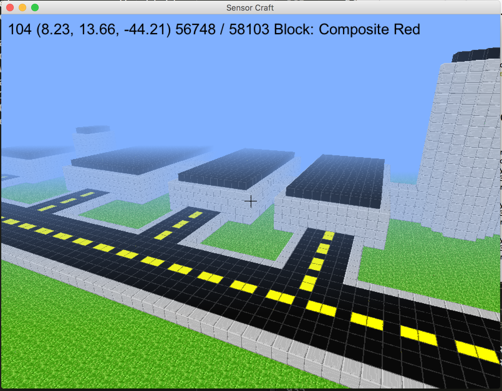

====================
08 Making the NMUSAF 
====================

With a game like SensorCraft you can build almost anything your house, your
school, or your favorite place.  For this exercise we are going to build our
favorite place the `National Museum of the United States Air Force
<http://www.nationalmuseum.af.mil/Home.aspx>`_ (NMUSAF). The NMUSAF is the
largest and oldest military aviation museum in the world located at Wright
Patterson Air Force Base in Dayton, Ohio.  Where else can you see a Wright Flyer
then see a B2 Stealth Bomber?  If you ever get a chance to visit Dayton, Ohio go
see the NMUSAF. Check out the code for exercise 8  '08_making_nmusaf.py', a number
of changes had to be made to make this work.  We added new textures in the file
'nmusaf_textures.png' and created keys to load and save the entire world.  To
load the world press the "L" key and to save the world press the "P" key.  We
used `Google Maps <https://www.google.com/maps/place/National+Museum+of+the+US+A
ir+Force/@39.7807961,-84.1115705,1019m/data=!3m2!1e3!4b1!4m5!3m4!1s0x8840832fc83
ffd85:0x71e29a127c5a32c9!8m2!3d39.7807961!4d-84.1093818>`_  to get a aerial view
of the NMUSAF which helped us keep things in scale.

