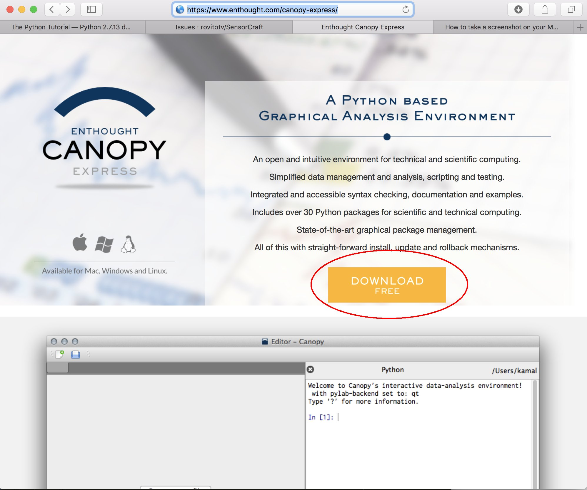
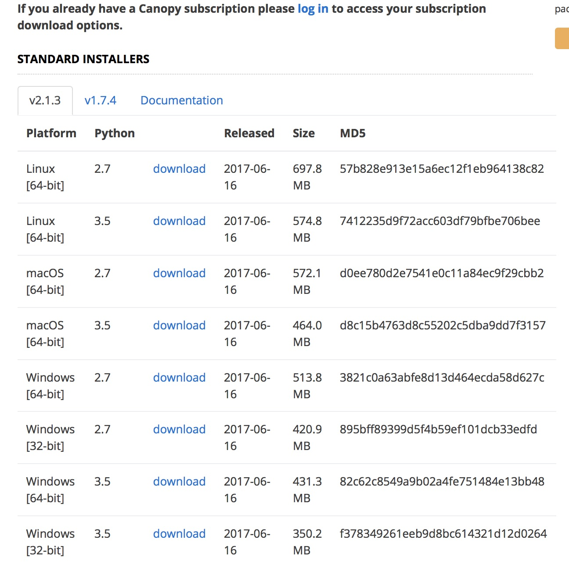
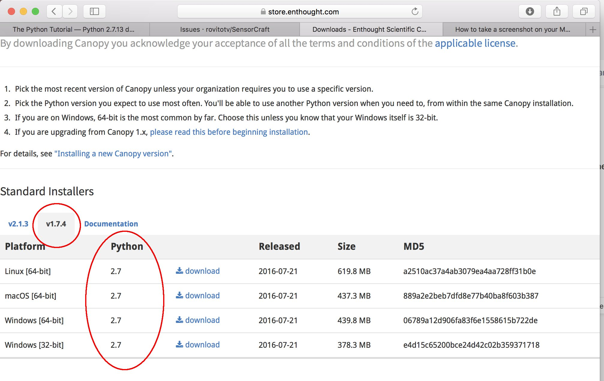
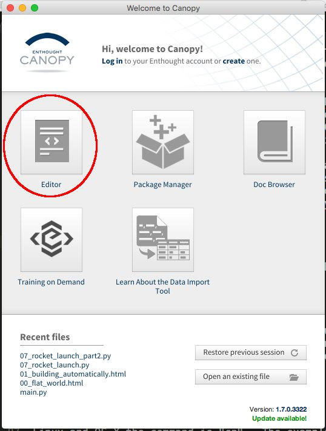
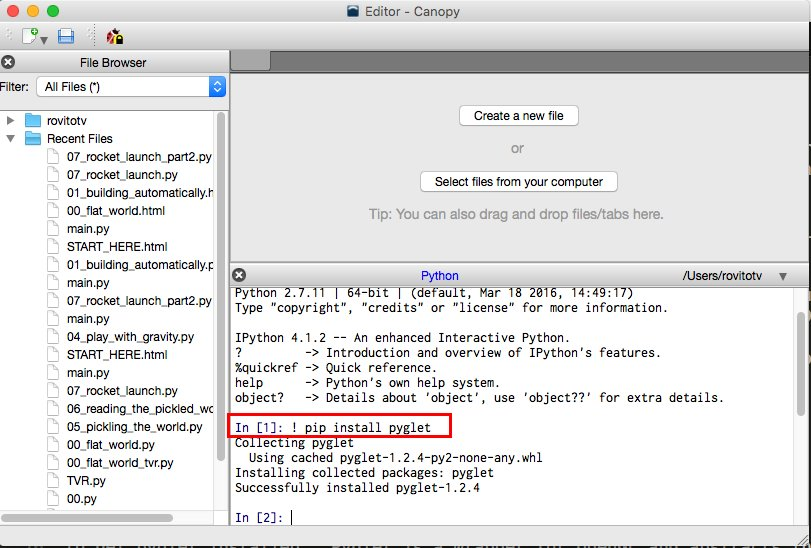
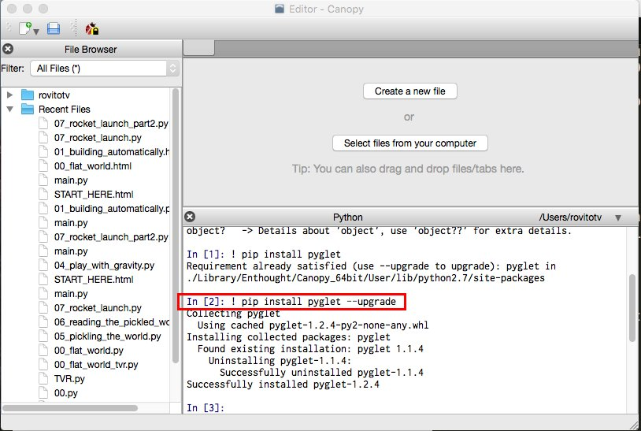
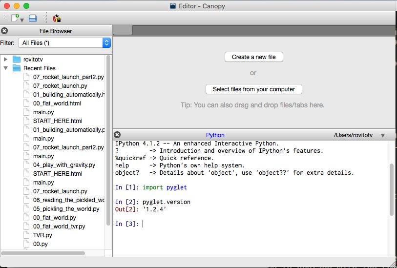
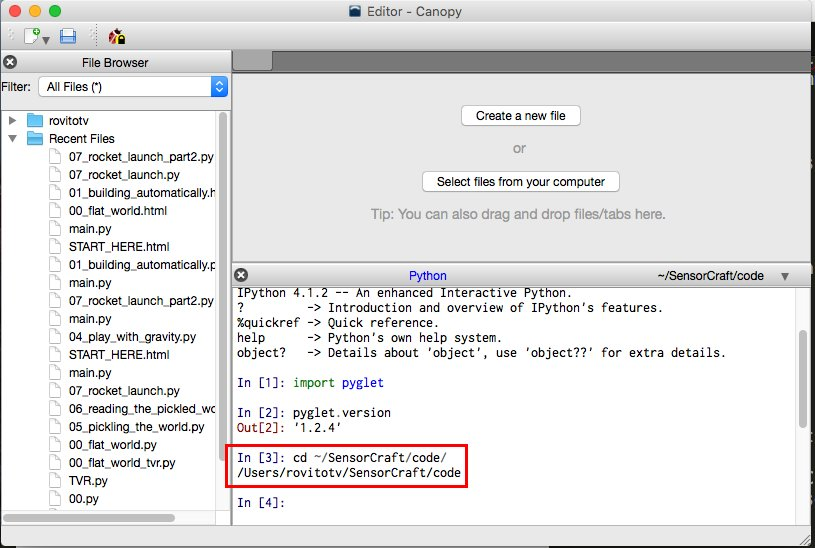
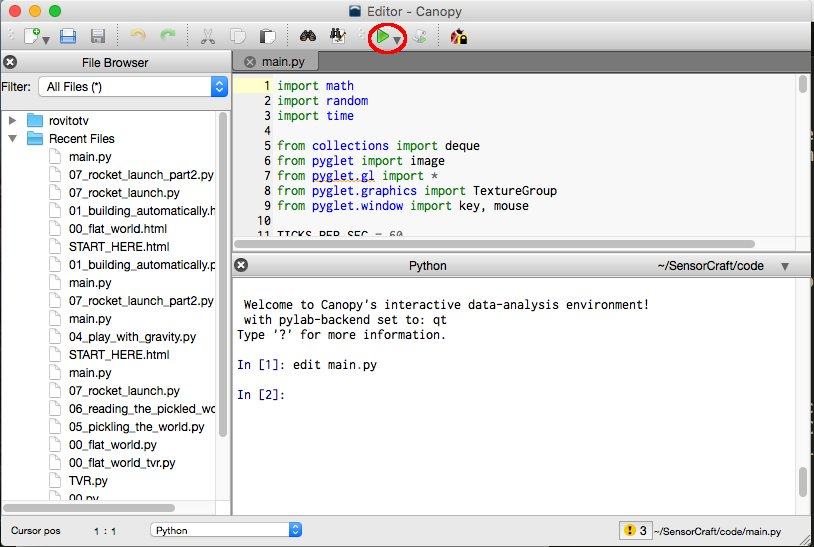
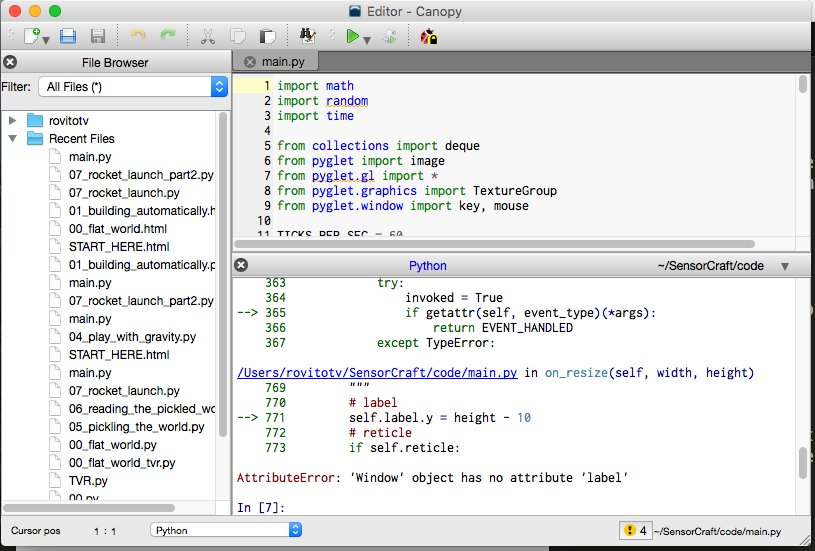

============
Introduction
============

Most people are familiar with Minecraft (Minecraft is developed by Mojang and
not related to this programming tutorial nor do they endorse this tutorial) for
this project we are using a Minecraft type environment created in the Python
programming language. The Air Force Research Laboratory (AFRL) Sensors
Directorate  located in Dayton, Ohio created this guide to inspire kids of all
ages to learn to program and at the same time get an idea of what it is like to
be a Scientist or Engineer for the Air Force.

Python is an amazing programming language that is a widely used high-level
programming language.  Python's design philosophy emphasizes code readability
with a code syntax that allows programmers to express concepts in fewer lines of
code than would be possible in other programming languages such as C++ or Java.
See the excellent `wikipedia page on Python
<https://en.wikipedia.org/wiki/Python_(programming_language)>`_  for more
information. To demonstrate the expressive power of Python consider that we can
create a Minecraft game in Python under 900 lines of code.  The game in this
tutorial is not a complete Minecraft clone but it is functional and offers us
the opportunity to explore adding more functions to it.

Python is used everyday at AFRL in all of our technical directorates.  Over the
last 10 years the language has excelled for science and engineering projects
with a emphasis on high performance computing. The Air Force Research Laboratory
is home to some of the `world's  fastest super computers
<http://www.top500.org/site/49284>`_,  with the most recent super computer named
Thunder which has over 125,000 CPU cores capable of computing 5.62 Petaflops and
it runs Python!

This project started with open source code from GitHub here:
https://github.com/fogleman/Minecraft

This code is open source with the original license in the file named LICENSE
take note we are permitted to use it and or modify it.  The original code is in
main.py and the original texture is called "texture.png".  Thank you fogleman
for your effort your project is an amazing foundation to build a STEM project
on. In science it is not unusual to start with somebody else's work. Sir Isaac
Newton is quoted as saying "if I have seen further, it is by standing on the
shoulders of giants". Newton was talking about how science builds upon the base
that has been built  before.  We would argue nowhere in the history of man kind
has the shoulders of giants concept been used like it has in software. Software
is easy to  replicate and share.  In Sir Isaac Newton's spirit this guide will
be on github for all to modify, edit, and add to as people see fit. I am not
perfect and I am sure this guide will have typos and mistakes please submit a
pull request.  If you make a cool programming exercise please feel free to
submit that modification via github here:

https://github.com/rovitotv/SensorCraft

Install
-------

To make things easier a `YouTube video has been created
<https://youtu.be/C9n1bS54AIw>`_ to show students how to install SensorCraft and
Enthought Canopy then run the examples.  The video is for Mac OS X but the
process for Windows and Linux is similar.

We are using Enthought Canopy for this guide.  Enthought offers a installer,
editor, and shell in a single package. The editor is great for beginners!
Enthought has a free version of Canopy called `Canopy Express
<https://www.enthought.com/canopy-express>`_ which will work with this guide on
the following operating systems Linux, Mac OS X, and Windows.  Download
and install Enthought Canopy Express just like any other program on your
operating system.  

SensorCraft is designed for Python 2.7 we hope in the near future to support 
Python 3.x.  Be careful when you are downloading Canopy Express you pick a 
version with Python 2.7 support.  Canopy now comes in two versions Canopy 
version 1.7.x which only supports Python 2.7 and Canopy 2.1.x which supports 
both Python 2.7 and Python 3.X.  It should not matter which version of Canopy 
you use Canopy 2.1.x or Canopy 1.7.x as long as you select the version with 
Python 2.7 support.  If you attempt to run SensorCraft with Python 3 you will 
receive an error message "NameError: name 'xrange' is not defined".

Download web page for Canopy 2.1.x with valid choices that support Python 2.7
circled:

Download web page for Canopy 1.7.x with valid choices that support Python 2.7
circled:

Start Canopy and you will be presented with the "Canopy
Welcome Screen", select the Editor button.  See below:

After Enthought Canopy Express is installed you will need
to get pyglet installed.  Pyglet is a wrapper for OpenGL and abstracts the
complicated graphics programming.  To install pyglet enter this command in
the Canopy shell::

	! pip install pyglet

A screen capture below shows where to enter the command into Canopy and the
expected results:

Depending on the version of Canopy you are using a older version of pyglet
might already be installed in which case you need to upgrade with the command::

	! pip install pyglet --upgrade

A screen capture below shows the upgrade process and the expected results:

Now we can import pyglet and verify the version number like in the screen
capture below:

If you get a strange error when running SensorCraft code that states::

    ImportError: cannot import name gl_info

Then you are not using the correct version of pyglet be sure to follow the
upgrade steps above and verify that you have the correct version.

After you have confirmed that the correct version of pyglet is installed, next
you have to download the `latest SensorCraft release zip file
<https://github.com/rovitotv/SensorCraft/releases/latest>`_.  The easiest thing
is to unzip SensorCraft and place in the home directory.  SensorCraft is simply
a bundle of html, py, and texture files.  This guide assumes that SensorCraft is
installed in the home directory with the simple name of SensorCraft please
rename to remove the version number.

Changing Directory
------------------

It is critical that you change to the ~/SensorCraft/code directory before
running each of the examples.  A screen shot of the change directory command
with the Canopy Python Shell is below:

The home directory will have a different name based on operating system but
the tilde key is universal within the Canopy Python shell.

Running a SensorCraft Program
-----------------------------

Now that you have all the software installed and are in the correct directory
you are now ready to run the basic SensorCraft program.  The base SensorCraft
program is called main.py within the directory ~/SensorCraft/code. The first
step is to edit main.py code with the following command in the Canopy
Python shell window::
	
	edit main.py

After this command is entered you will notice that the editor now shows the
main.py code, you can now explore the code by scrolling up and down.  Take
note the base game is less than 900 lines of code.  To run the game click on
the green arrow in the top menu bar.  Below is a screen capture that
shows what Canopy looks after the edit command is entered and has circled
the green arror to run main.py:

To stop a SensorCraft program first you must push the escape key, sometimes
known as esc, to defocus mouse control from SensorCraft back to your desktop.
After you have restored mouse control simply close the SensorCraft game window
like you would any program, usually clicking the "red x" in the window corner.

Restart of the Python Kernel
----------------------------

Due to an issue with pyglet and Canopy Python shell you have to restart the
Python kernel between runs of your program.  If you forget to restart the
Python kernel you will receive an attribute error as shown below:

This is easy to fix all you have to do is restart your kernel which can be
done via the Canopy menu system as illustrated in picture below:

.. figure:: ../images/canopy_kernel_restart_menu.jpg
    :align: center

Or as an alternative you can use a hot key on Mac OS X use command-. and on
both Windows and Linux use ctrl-. the appropriate hot key combination is 
shown in the menu bar.  

Getting Started
---------------

Each separate tutorial builds on the previous tutorial but they are designed
to stand on their own so feel free to skip around.  The tutorials start with
simple objectives and builds to more difficult objectives. To get started first
copy main.py into a new file name with the copy command like so::

	cp main.py 00_flat_world_TVR.txt

On Microsoft Windows platforms the copy command is spelled out "copy" and for
Linux and OS X the command is "cp".  The example above uses the programmer's
initials on the end of the file. 

Programming Exercises
---------------------

In this chapter we dive in with several different fun examples of extending
the SensorCraft game.  Review the examples and try the code, all of the
exercises have complete answers in the code directory in case you get stuck. 

